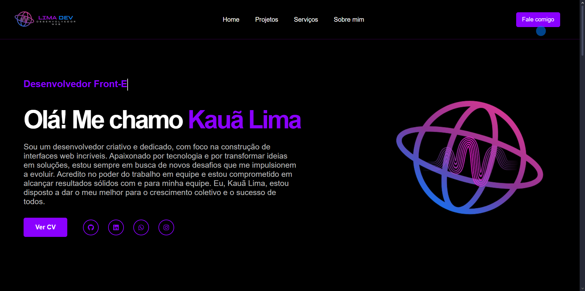

# 🌐 Meu Portfólio

Bem-vindo ao meu portfólio pessoal! Este projeto foi desenvolvido com o objetivo de apresentar minhas habilidades, experiências e projetos de forma interativa e moderna.

> ⚠️ Este site **não foi desenvolvido de forma profissional**, mas sim como uma forma de **praticar minhas habilidades** em desenvolvimento web e, ao mesmo tempo, **criar algo significativo para a minha carreira como dev**.

## ✨ Funcionalidades

- 📄 **Análise de Currículo**  
  Uma seção dedicada para visualizar e analisar meu currículo diretamente no site.

- 🔗 **Links para Redes Sociais**  
  Acesso rápido aos meus perfis profissionais, como LinkedIn, GitHub e outras plataformas.

- 🎢 **Efeitos de Scroll**  
  Animações suaves ao navegar pela página, proporcionando uma experiência mais agradável ao usuário.

- 📬 **Envio de E-mails**  
  Formulário de contato integrado, que permite que visitantes enviem mensagens diretamente para o meu e-mail.

## 💻 Tecnologias Utilizadas

- **HTML**
- **CSS**
- **React**

O projeto foi construído com foco em responsividade e desempenho, utilizando boas práticas de desenvolvimento front-end.

---

Sinta-se à vontade para visitar o site, conhecer meus projetos e entrar em contato! 🚀
